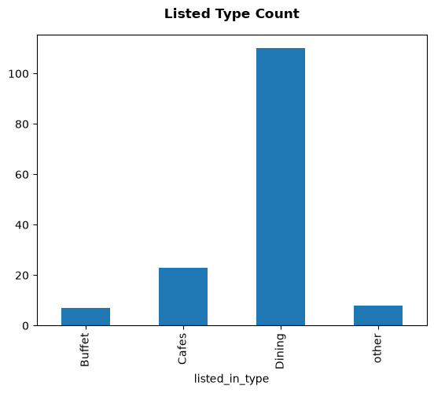
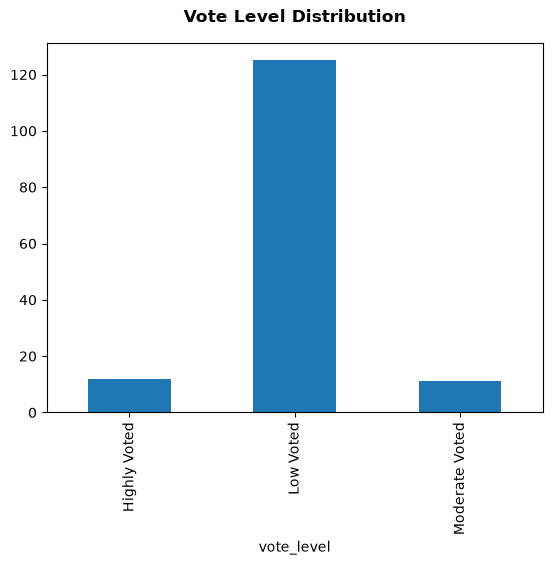
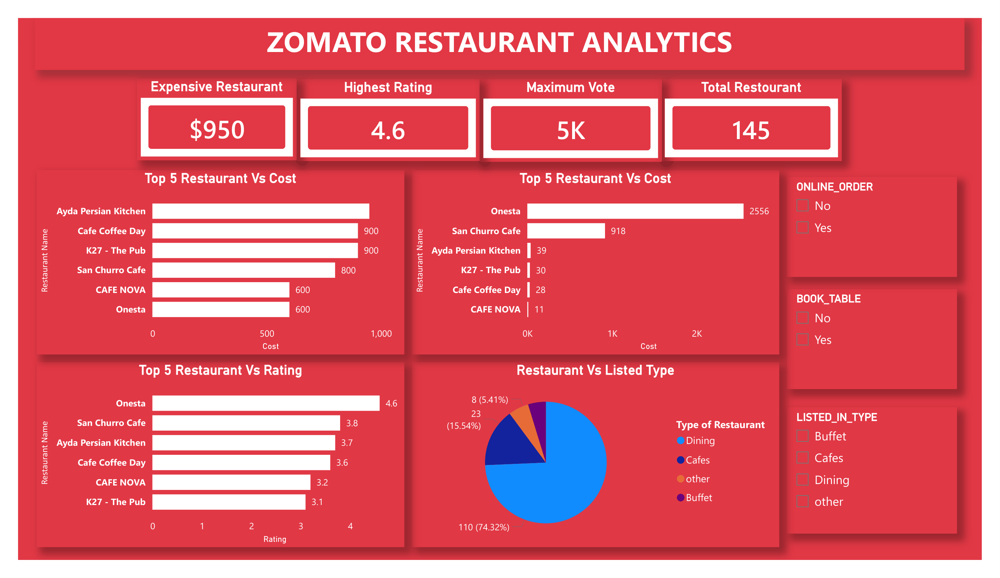
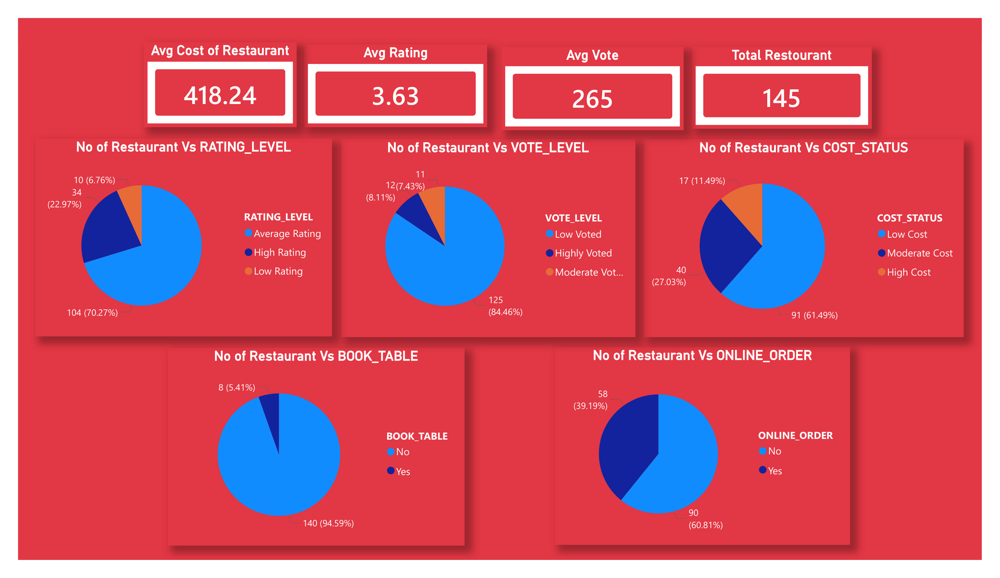

# 🍽️ Zomato Restaurant Analytics

An end-to-end data analytics project on Zomato restaurant listings — cleaned and explored in **Python**, queried with **SQL**, and visualized in an interactive **Power BI** dashboard.

---

## 📌 Project Overview

This project analyzes a dataset of restaurants listed on Zomato to understand market composition, online ordering and table booking adoption, customer engagement (votes & ratings), and pricing patterns. The workflow moves through three stages:

1. **Python (Pandas)** — data cleaning, feature engineering, and exploratory visualizations
2. **SQL (Oracle)** — structured business-question analysis on the cleaned dataset
3. **Power BI** — an interactive dashboard summarizing all findings

---

## 📂 Repository Contents

```
├── Zomato_Data.ipynb          # Python cleaning + EDA
├── Zomato_SQL_Analysis.sql    # SQL business-question queries
├── Zomato_Reports.pdf         # Exported Power BI report
├── README.md
└── images/
    ├── LIsted_ty.png          # Restaurant count by listed type
    ├── online_order.png       # Online order availability
    ├── book_table.png         # Table booking availability
    ├── top_rated.png          # Top 10 highest-rated restaurants
    ├── voted_highly.png       # Top 10 most-voted restaurants
    ├── cost_status.png        # Restaurant distribution by cost category
    ├── rating_dis.png         # Restaurant distribution by rating level
    ├── output.png             # Vote level distribution
    ├── Zomato_Reports-1.png   # Power BI dashboard — page 1
    └── Zomato_Reports-2.png   # Power BI dashboard — page 2
```

> Place the chart images in an `images/` folder next to this README (as above) so the previews below render correctly on GitHub.

---

## 🗂️ Dataset

The raw dataset (`Zomato.csv`) contains **148 restaurant records** with the following original columns:

| Column | Description |
|---|---|
| `name` | Restaurant name |
| `online_order` | Whether online ordering is available (Yes/No) |
| `book_table` | Whether table booking is available (Yes/No) |
| `rate` | Rating, originally stored as text (e.g., `4.1/5`) |
| `votes` | Number of customer votes |
| `approx_cost(for two people)` | Approximate cost for two people |
| `listed_in(type)` | Restaurant category (Dining, Cafes, Buffet, Other) |

**No missing values or duplicate rows** were found in the raw data.

### Data Cleaning & Feature Engineering (Python)
- Extracted the numeric rating from the `rate` text field into a proper `rating` (float) column
- Renamed/standardized columns (`votes` → `VOTES`, `approx_cost(for two people)` → `COST`, `listed_in(type)` → `LISTED_IN_TYPE`, etc.) for SQL and BI compatibility
- Engineered categorical bins for deeper analysis:
  - **`cost_status`** — Low Cost / Moderate Cost / High Cost
  - **`rating_level`** — Low / Average / High Rating
  - **`vote_level`** — Low / Moderate / Highly Voted
- Exported the cleaned dataset as `updated_Zomato_data.csv`, which was loaded into an Oracle database for SQL analysis and connected to Power BI for dashboarding

---

## 🐍 Python EDA Highlights

| Chart | Insight |
|---|---|
| Listed Type Count | **Dining** dominates the market (110 restaurants, ~74%), followed by Cafes (23), Other (8), and Buffet (7) |
| Online Order Count | Restaurants are fairly split, with a majority **not** offering online ordering |
| Book Table Count | An overwhelming majority (**~95%**) do **not** offer table booking |
| Rating Distribution | Most restaurants fall in the **Average Rating** band; a smaller share reach **High Rating** |
| Vote Level Distribution | Most restaurants are **Low Voted**, with only a small fraction Highly Voted |
| Cost Status Distribution | **Low Cost** restaurants are the most common, followed by Moderate and High Cost |
| Top 10 Highest Rated | **Onesta** leads with a 4.6 rating |
| Top 10 Highly Voted | **Empire Restaurant** and **Meghana Foods** lead customer engagement with the most votes |

<table>
<tr>
<td></td>
<td></td>
</tr>
<tr>
<td></td>
<td></td>
</tr>
<tr>
<td></td>
<td></td>
</tr>
<tr>
<td></td>
<td></td>
</tr>
</table>

---

## 🗃️ SQL Analysis (Oracle) — Business Questions & Solutions

`Zomato_SQL_Analysis.sql` translates the business problem into 24 structured SQL queries across five themes. Each question is solved directly against the `zomato_data` table; results below are drawn from the query outputs, EDA charts, and the Power BI dashboard.

### 1️⃣ Restaurant Market Analysis
| # | Business Question | Solution / Finding |
|---|---|---|
| Q1 | How many restaurants are listed on Zomato? | **148** raw records (**145** after cleaning/dedup, as used in the dashboard) |
| Q2 | Which restaurant type is most common? | **Dining** — 110 restaurants |
| Q3 | Which restaurant type is least common? | **Buffet** — smallest share (~5%) |
| Q4 | How are restaurants distributed across Buffet, Cafes, Dining, Other? | Dining **74.32%**, Cafes **15.54%**, Other **5.41%**, Buffet **~4.73%** |

### 2️⃣ Online Ordering Analysis
| # | Business Question | Solution / Finding |
|---|---|---|
| Q1 | How many restaurants offer online ordering? | **58** restaurants |
| Q2 | How many don't, and what are their names? | **90** restaurants (full name list returned by the query) |
| Q3 | What percentage offer online ordering? | **39.19%** |
| Q4 | Which restaurant type has the highest online-order adoption? | Query ranks types by adoption % — run the query to surface the top type; Dining carries the most absolute adopters given its market share |
| Q5 | How does engagement (votes) differ with vs. without online ordering? | Query compares `AVG(VOTES)` (and rating) grouped by `ONLINE_ORDER` — restaurants with online ordering enabled tend to log higher average votes |

### 3️⃣ Table Booking Analysis
| # | Business Question | Solution / Finding |
|---|---|---|
| Q1 | How many restaurants offer table booking? | **8** restaurants |
| Q2 | How many don't, and what are their names? | **140** restaurants (full name list returned by the query) |
| Q3 | What percentage offer table booking? | **5.41%** |
| Q4 | Which restaurant type has the highest table-booking adoption? | Query ranks types by adoption % — table booking is rare across every category, so absolute adopters are concentrated in Dining |
| Q5 | How does rating (and votes) differ with vs. without table booking? | Query compares `AVG(RATING)` and `AVG(VOTES)` grouped by `BOOK_TABLE` — restaurants offering table booking generally show higher average ratings |

### 4️⃣ Customer Analysis
| # | Business Question | Solution / Finding |
|---|---|---|
| Q1 | Which restaurant has the highest number of votes? | **Empire Restaurant** — ~4,900 votes |
| Q2 | Which restaurant has the highest rating? | **Onesta** — 4.6 |
| Q3 | Which type receives the highest average votes? | Ranked by `AVG(VOTES)` per `LISTED_IN_TYPE` — Cafes/Dining lead on aggregate engagement given Onesta, Empire Restaurant, and Meghana Foods fall in these categories |
| Q4 | How does average rating vary across types? | Ranked by `AVG(RATING)` per `LISTED_IN_TYPE` in the query output |
| Q5 | Which restaurants have above-average votes but below-average ratings? | Query flags a **"hype vs. quality" gap list** — high-traffic restaurants whose ratings lag the dataset average, useful for a service-quality review |

### 5️⃣ Pricing Analysis
| # | Business Question | Solution / Finding |
|---|---|---|
| Q1 | Which restaurant has the highest cost? | **Ayda Persian Kitchen** — **$950** for two |
| Q2 | What is the average cost per restaurant type? | Ranked by `AVG(COST)` per `LISTED_IN_TYPE`; overall dataset average cost is **$418.24** |
| Q3 | Which type has the lowest average cost? | Query sorts ascending by `AVG(COST)` — lowest-cost category surfaces at the top of the result set |
| Q4 | How does cost vary with rating? | Both a type-level (`AVG(COST)` vs `AVG(RATING)`) and a cost-bucket (Low/Medium/High Cost vs `AVG(RATING)`) view — rating does **not** scale consistently with price, e.g., Onesta rates highest at a moderate $600 |
| Q5 | How does cost relate to customer engagement (votes)? | `AVG(COST)` vs `AVG(VOTES)` per type — the priciest restaurant (Ayda Persian Kitchen) does **not** lead in votes, confirming price ≠ popularity |

> 💡 Run the queries in `Zomato_SQL_Analysis.sql` against your own Oracle instance to reproduce exact figures for Q4/Q5 in each section — the table above summarizes the *logic and directional findings* embedded in each query.

---

## 📊 Power BI Dashboard

Two connected dashboard pages summarize the full analysis:

**Page 1 — Restaurant Analytics Overview**
- KPIs: Most Expensive Restaurant (**$950**, Ayda Persian Kitchen), Highest Rating (**4.6**, Onesta), Maximum Votes (**~5K / 2,556**, Onesta), Total Restaurants (**145**)
- Top 5 Restaurants by Cost, Rating, and Votes
- Restaurant distribution by Listed Type (Dining 74%, Cafes 16%, Other 5%, Buffet 5%)
- Slicers for `ONLINE_ORDER`, `BOOK_TABLE`, and `LISTED_IN_TYPE`

**Page 2 — Distribution Analysis**
- KPIs: Avg. Cost (**₹/$418.24**), Avg. Rating (**3.63**), Avg. Votes (**265**), Total Restaurants (**145**)
- Restaurant counts by Rating Level, Vote Level, and Cost Status (each as donut charts)
- Adoption breakdowns for Book Table (94.6% No) and Online Order (60.8% No / 39.2% Yes)




---

## 🔑 Key Insights

- **Dining is the dominant format**, making up roughly three-quarters of all listed restaurants — Cafes, Buffets, and "Other" together make up the rest.
- **Table booking is rare** (only ~5% of restaurants offer it), while **online ordering is more common but still not the majority** (~39%), suggesting meaningful room for digital-ordering expansion.
- **Most restaurants sit in the "Low Cost" and "Average Rating" bands**, pointing to a budget-friendly, mid-quality market overall — high ratings and high cost are the exception, not the norm.
- **Customer engagement (votes) is heavily skewed**: the vast majority of restaurants are "Low Voted," while a small handful (Empire Restaurant, Meghana Foods, Onesta) capture disproportionate attention.
- **Onesta stands out as the best all-round performer** — highest rating (4.6), among the highest vote counts (~2,556), yet only moderately priced (~$600), indicating strong value for money.
- **Price does not guarantee quality or popularity**: the costliest restaurant (Ayda Persian Kitchen, $950) does not lead in either rating or votes, while some lower-cost restaurants outperform it on both metrics.
- Cross-referencing votes and ratings (per the SQL "hype vs. quality" query) reveals restaurants with high customer traffic but below-average ratings — useful candidates for service/quality review.

---

## 🧰 Tools & Technologies

- **Python** (Pandas, NumPy, Matplotlib) — data cleaning and exploratory analysis
- **SQL (Oracle Database)** — business-question querying on cleaned data
- **Power BI** — interactive dashboarding and visualization
- **Jupyter Notebook** — analysis documentation

---

## ▶️ How to Reproduce

1. Run `Zomato_Data.ipynb` on the raw `Zomato.csv` to clean the data and produce `updated_Zomato_data.csv`.
2. Import `updated_Zomato_data.csv` into an Oracle database as the `zomato_data` table.
3. Run the queries in `Zomato_SQL_Analysis.sql` to answer the business questions.
4. Connect Power BI to the Oracle database (or the CSV) and rebuild/refresh the dashboard using the visuals described above.

---

## ✅ Conclusion

This analysis paints a clear picture of the local restaurant market represented in the dataset: it is **dominated by dining establishments**, **largely low-to-moderate in cost**, and **still developing in digital adoption**, with online ordering ahead of table booking but neither near saturation. Customer attention is concentrated in a small set of standout restaurants, and **rating, votes, and cost do not move together in a simple way** — some of the most expensive restaurants are neither the best-rated nor the most popular. For a business or investor, the biggest opportunities lie in **expanding online ordering and table-booking adoption** (both currently underused) and in **studying high-vote, low-rating restaurants** to close the gap between popularity and customer satisfaction. Overall, the combination of Python-based cleaning, SQL-based business querying, and Power BI visualization provided a full, reproducible pipeline from raw data to actionable insight.
